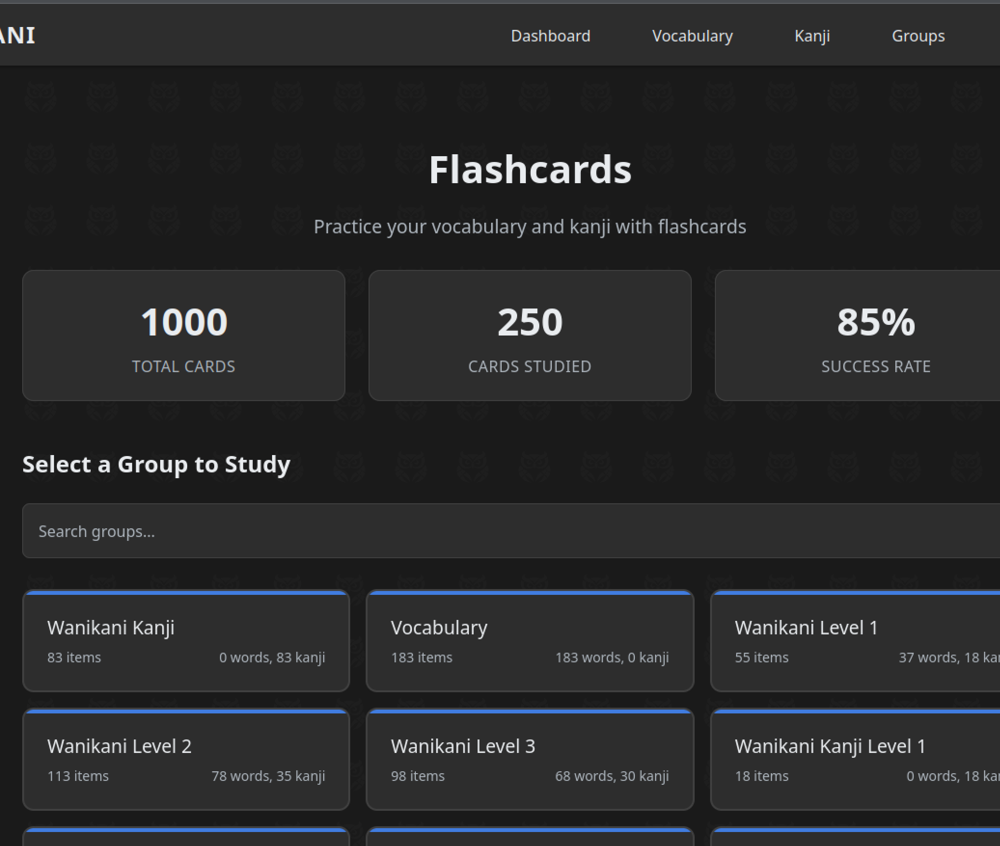

# DuoKani - A Comprehensive Japanese Language Learning Platform
DuoKani is a WaniKani companion application that leverages AI to teach vocabulary and kanji in a more immersive and interactive way.

## Features
- Dashboard with progress tracking.
- Wikipedia crawler for vocabulary building and read-along.
- DuoRadio-style game for listening comprehension.
- Onboarding wizard for WaniKani or JLPT N5.
- Database of vocabulary and kanji.
- Dark mode.
- Responsive design.

## Watch demo on YouTube
[](https://www.youtube.com/watch?v=bOj1Uxb1BcQ)

## Screenshots
### Dashboard


### List of Activities/Games


### Wikipedia Crawler


### DuoRadio


### Onboarding Wizard


### Study Session Group Selection


### Study Groups


### Item Details


## Prerequisites
- Gemini API key ([get from here for free](https://aistudio.google.com/app/apikey))
- Docker, Docker Compose v2 and available ports 80, 8000, 8001, 8002, 8003, 4200
- Git

## Setup and Running

1. Clone the repository and navigate to the project directory:
   ```bash
   git clone https://github.com/pohlondrej/free-genai-bootcamp-2025.git
   cd final-project
   ```

2. Build and start all services:
   ```bash
   docker compose up --build
   ```

3. Access the application:
   - Frontend through NGINX: http://localhost:80 or http://127.0.0.1:80
   - Other ports can be found in the [Project Specification](docs/Project.md)

4. Stop the services to free up resources and networks/ports:
   ```bash
   docker compose down
   ```
