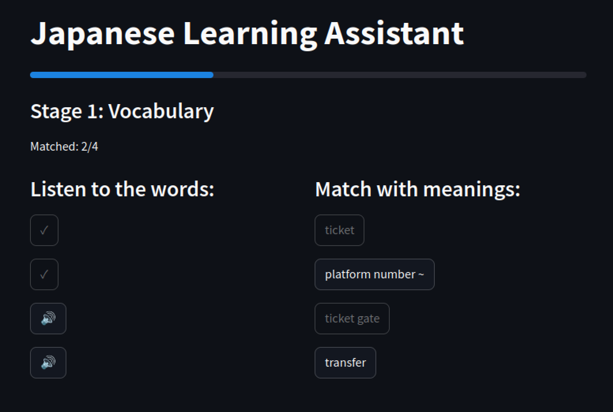
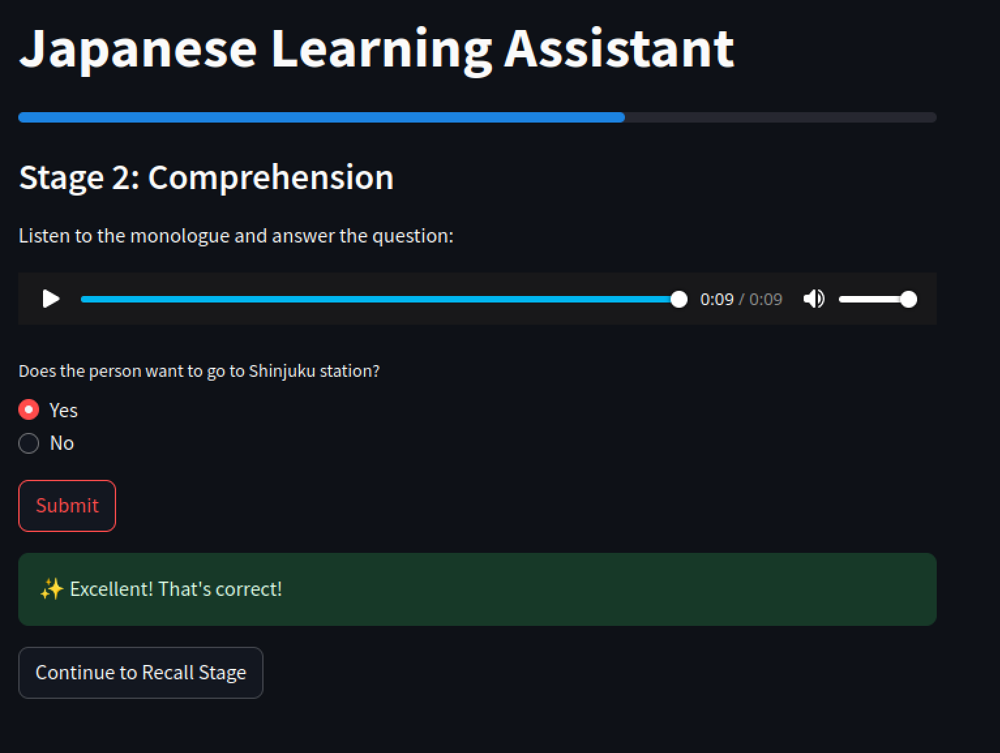
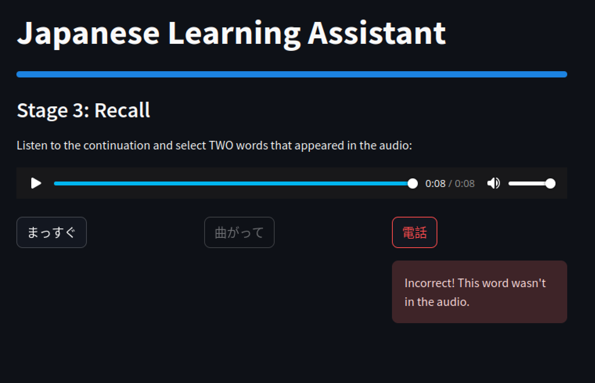
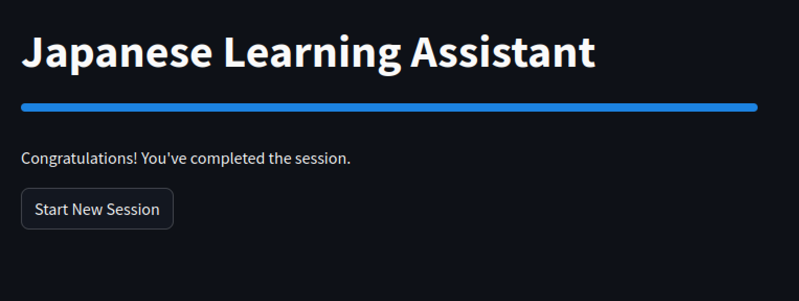

# Language Learning Assistant
A listening comprehension application inspired by [DuoRadio](https://blog.duolingo.com/duoradio-listening-practice/) by Duolingo.

## Docs
- [Project Description](docs/Project.md) - high-level project overview, API description
- [Tasks](docs/Tasks.md) - step-by-step tasks used to develop this project
- [Next Steps](docs/Improvements.md) - cool ideas for furture development

## Screenshots





## Setup
### Python Environment
**Python 3.10 is required!**

Highly recommended to use Conda for virtual environment setup; (this setup assumes Conda is installed):
#### Create Conda Environment:
```
conda create -n "langassist_duoradio" python=3.10
conda activate langassist_duoradio
```
#### Install Required Python Packages:

### Set Environment Variables
LLM API key and model must be specified before starting the server.
- Gemini 2.0 Flash was used during development, and is set as default option.
    - Still requires `LLM_API_KEY` or `GEMINI_API_KEY` to run, though.
    - `GEMINI_API_KEY` works for both LLM and embedding model.
- All models supported by LiteLLM can be used, although no models except Gemini were tested.

[Supported Providers](https://docs.litellm.ai/docs/providers)

[Free Gemini API Key](https://aistudio.google.com/app/apikey) 
#### Required environment variables
```bash
export LLM_API_KEY="your-api-key-here"
export LLM_MODEL="your-cloud-llm" # gemini/gemini-2.0-flash by default
export EMBEDDING_MODEL_API_KEY="your-embedding-model-api-key-here"
export EMBEDDING_MODEL="your-cloud-embedding-model" # "gemini/text-embedding-004" by default
```

#### Optional environment variables
```bash
export LLM_TEMPERATURE="0.7"
export LLM_MAX_RETRIES="3"
export LLM_TIMEOUT="30"
export CHROMA_DB_DIR="/path/to/chroma/db"  # Vector database location, defaults to ./chroma_db
export AUDIO_CACHE_DIR="/path/to/audio/cache"  # Audio cache location, defaults to ./audio_cache
```

### Launch
To start the server, simply run:
```bash
python run.py
```
from the Conda environment. Please allow ~10-15 seconds for the server to start.

**Enjoy!**