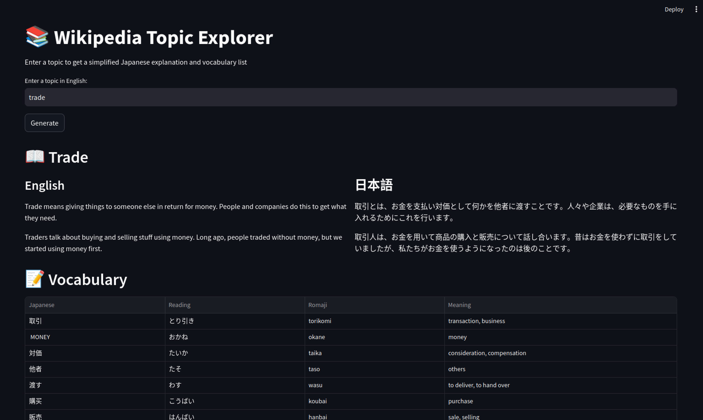

# Wikipedia Topic Explorer and Japanese Vocabulary Builder

This app is a demonstration of AI agentic workflow. It will create short, informative summaries about any given topic in Japanese, along with a vocabulary list of key terms used in the summary.



## Features

- Generate summaries of Wikipedia articles in Japanese
- Simplify English text to 9-year-old reading level
- Translate content to Japanese using JLPT N5 level
- Generate vocabulary lists with readings and meanings

## Technical Documentation
For detailed technical specifications and architecture, see [Project Documentation](docs/Project.md).

## Workflow

1. User provides a topic in English
2. App uses Wikipedia API to fetch the article in English
3. LLM simplifies the article to the point a 9-year-old could understand
4. LLM translates the simplified article into Japanese, using only JLPT N5 vocabulary, grammar and Kanji
5. LLM generates a vocabulary list of key terms used in the summary
6. App presents the summary and vocabulary list to the user in a clean, organized interface

## Setup

1. Install dependencies:
```bash
pip install -r requirements.txt
```

2. Start the backend server:
```bash
uvicorn api:app --reload
```

3. Start the frontend server:
```bash
streamlit run frontend.py
```

## Usage

1. Open your browser and navigate to http://localhost:8501
2. Enter any topic in English
3. Click "Generate" to see the Japanese summary and vocabulary

## Future Improvements

1. Visual Enhancements
   - Add image support using DuckDuckGo API
   - Support for dark/light theme switching
   - Mobile-responsive design

2. Language Learning Features
   - Add JLPT level indicators for vocabulary
   - Include example sentences for each vocabulary word
   - Add audio pronunciation for Japanese words
   - Support for different JLPT levels (N5-N1)

3. Content Enhancements
   - Support for multiple Wikipedia sections
   - Related topics suggestions
   - Save and export functionality for vocabulary lists
   - Progress tracking for learned vocabulary

4. Technical Improvements
   - Caching for frequently requested topics
   - Offline mode with downloaded content
   - API rate limiting and optimization
   - Support for additional language pairs